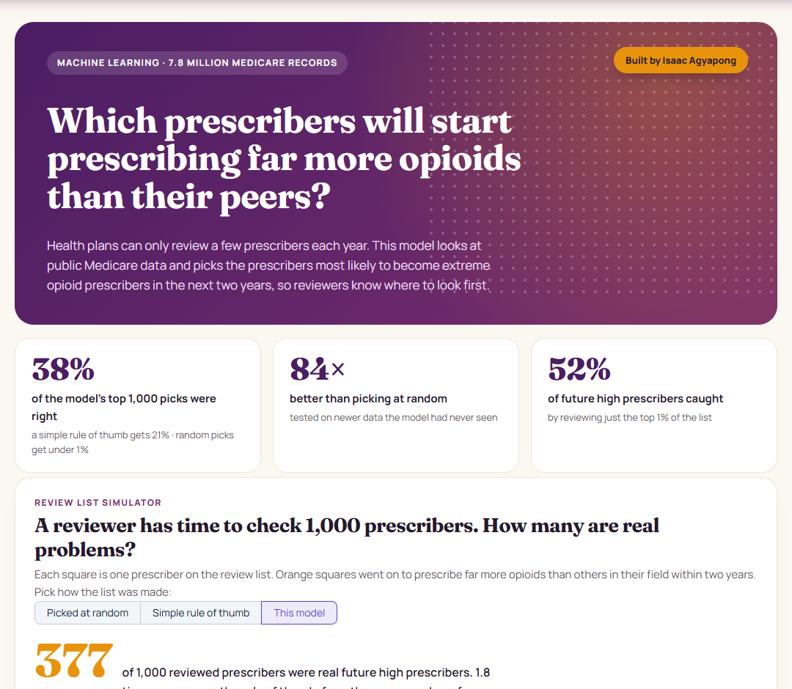
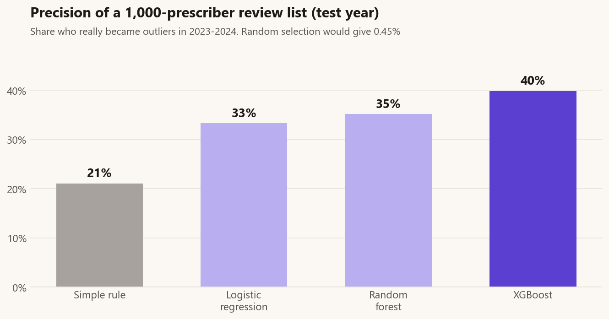
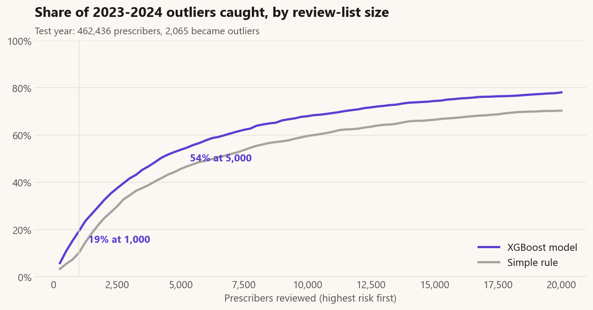
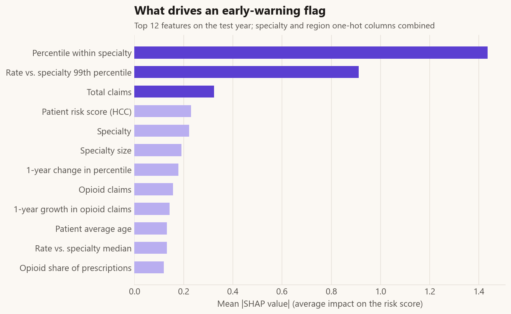
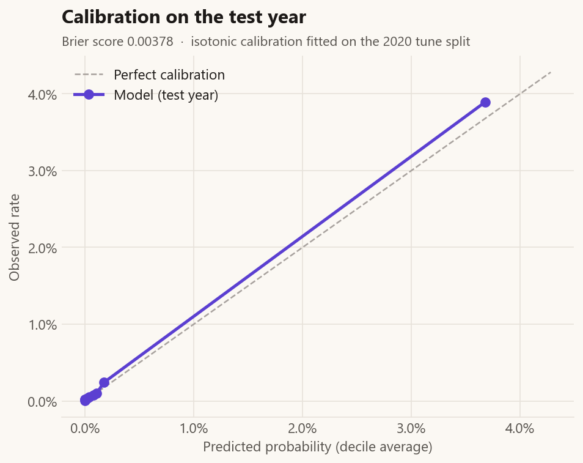
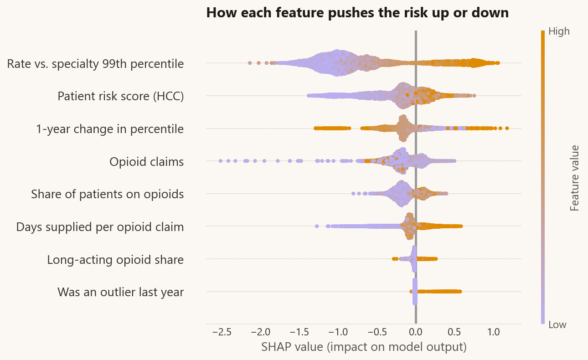
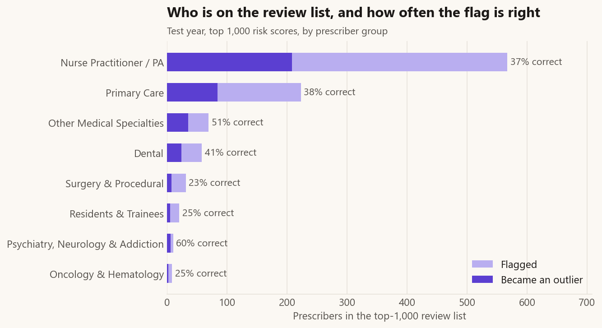
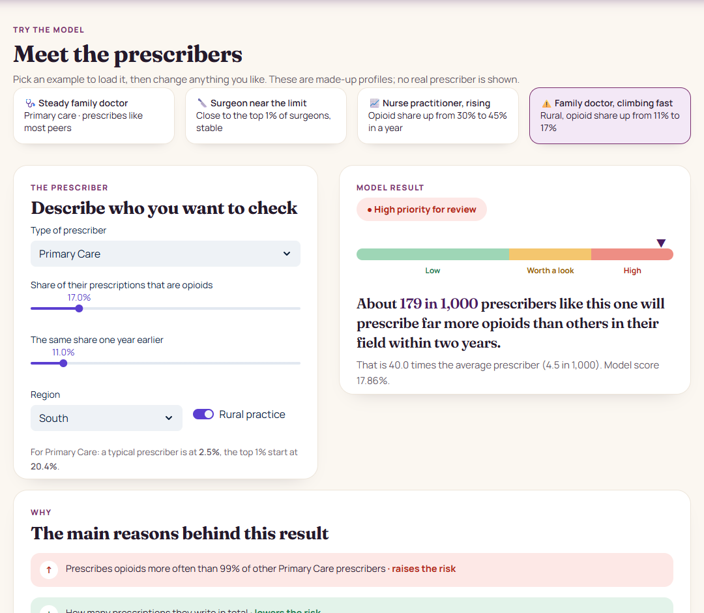

# Early Warning Machine Learning Model for High-Risk Opioid Prescribing

A tool that predicts which prescribers are likely to start prescribing far more opioids than others in their field
within the next two years. I built it from 7.8 million real Medicare records.

> **In short:** a health plan or state program can only review a small number of prescribers each year, so it needs
> to know where to look first. When this tool picks 1,000 prescribers to review, about **38 in 100** of them really
> do become high prescribers. A simple rule of thumb gets **21 in 100**, and picking at random gets **less than 1**.
> I tested it on newer data it had never seen, and every prediction comes with a plain explanation of why the
> prescriber was flagged. A flag is a reason for a supportive review, not proof that anyone did anything wrong.

### ▶ [Try the live app: opioid-early-warning.streamlit.app](https://opioid-early-warning.streamlit.app)

[](https://opioid-early-warning.streamlit.app)

The rest of this page has the details.

---

## The problem

In [my earlier project](https://github.com/Isaac-Agyapong/Medicare_Opioid_Prescribing) I found that about 1 in 100
Medicare prescribers write far more opioid prescriptions than others in the same specialty, and 78 in 100 of them
are still doing so the next year. Finding the ones who already prescribe heavily is easy. The harder and more useful
question is:

> **Among prescribers who are not heavy prescribers today, who will become one within two years?**

Very few do: about 2,000 out of 460,000 a year (fewer than 1 in 200). A health plan can only look at a short list, so
what matters is how many of the people on that list really go on to become heavy prescribers.

## What I found

I trained the model on older years and tested it on 2022, a year it had never seen, checking what happened in
2023 and 2024.

| Out of 1,000 prescribers picked for review | Became heavy prescribers |
|---|---|
| Picked at random | about 4 or 5 |
| Picked by a simple rule (those already closest to the top in their specialty) | 211 |
| **Picked by the model** | **377** |

I got almost the same result when I tested on 2021 instead: 38 in 100 for the model, 22 in 100 for the rule.

| | |
|---|---|
|  |  |
|  |  |

## What makes the model flag someone



- The strongest sign is where a prescriber already sits compared with others in the same specialty, and how close
  they are to the top. Next come how many prescriptions they write, how sick their patients are, and their specialty.
- A sudden one-year jump doesn't always mean higher risk. The model learned that some jumps fall back the next year,
  which a simple rule can't tell.
- Nurse practitioners and physician assistants make up 57 in 100 of the 1,000 people on the review list. This fits
  what I found in the earlier project: they now write a growing share of opioid prescriptions.



## The app

**Live:** https://opioid-early-warning.streamlit.app

A four-page app written for people without a statistics background:

- **Home:** a grid of 1,000 squares shows how many people on a review list really become heavy prescribers when the
  list is picked at random (about 4), by a simple rule (211) or by this model (377).
- **Try the model:** load one of four example prescribers with one click, or describe your own. The app scores it
  straight away, says the result in plain words ("about 179 in 1,000 prescribers like this one...") and lists the
  main reasons.
- **Evidence** and **About the data:** how the model was tested, and what it must not be used for.



The app works with made-up example profiles, not real prescribers. No prescriber's ID is shown or stored here.

## How it should and shouldn't be used

| | |
|---|---|
| **Good use** | Choosing whom to offer a supportive review first (education, checks in the prescription monitoring system) |
| **Not for** | Penalties, removing someone from a network, or any decision without a person reviewing it. A flag is a statistical signal, not evidence of bad care |
| **Data** | Medicare Part D prescriber records 2019-2022, with what happened in 2021-2024 |
| **Who is scored** | Prescribers with 100 or more Medicare drug claims a year who are not already heavy prescribers |
| **"Heavy prescriber" means** | At or above the top 1% of their specialty and at least 3 times the typical rate, with 50 or more opioid claims |

## Limits

- Medicare Part D only, so mostly patients aged 65 and over.
- Prescribers who leave Medicare can't be followed up, so they aren't scored.
- Specialties come from Medicare's own labels.
- Prescribing patterns change, so the model should be checked again every year.

## Technical details

For readers who want the specifics:

| Test year 2022 (outcomes 2023-24) | Simple rule | Logistic regression | Random forest | XGBoost |
|---|---|---|---|---|
| Precision of a 1,000-prescriber list | 21.1% | 33.5% | 36.4% | **37.7%** (95% CI 34.3-40.4%) |
| Lift over random | 47x | 75x | 82x | **84x** |
| Recall in the top 1% of scores | 43.5% | 39.4% | 50.0% | **52.1%** |
| PR-AUC | 0.149 | 0.159 | 0.219 | **0.233** |
| ROC-AUC | 0.921 | 0.941 | 0.950 | 0.949 |

- **Time-based testing:** fit on 80% of the 2020 snapshot, tuned on the other 20%, backtested on 2021, tested once
  on 2022. A first version tuned on 2021, whose outcome years overlapped the test; fixing that lowered test
  precision from 39.9% to 37.7%, the number reported here.
- **Current heavy prescribers excluded**, so the model gets no credit for people already flagged.
- **Calibration:** isotonic, fitted on the 2020 tuning split; average predicted rate 0.41% against 0.45% observed
  (Brier score 0.0038).
- **Uncertainty:** 95% confidence intervals from 1,000 bootstrap resamples; the gain over the rule (+16.6 points,
  95% CI +12.8 to +19.7) is positive in every resample.
- **Reasons:** SHAP values for each prediction.
- **Features (19 plus specialty group and region):** opioid share of prescriptions, rank within specialty, ratio to
  the specialty median and top 1%, prescription and patient volume, long-acting opioid share, days supplied per
  claim, share of patients on opioids, patient age and risk score, rural practice, specialty size, and one-year
  changes.

```
opioid_analytics (PostgreSQL, from the earlier project)
   └── SQL/01_features.sql ──> ml.prescriber_snapshot   1.3M prescriber-years
          └── Python/02_train_models.py ──> rule, logistic regression, random forest, XGBoost; calibration; bootstrap
                 └── Python/03_model_results.ipynb ──> charts + SHAP
                        └── app/app.py (Streamlit)
```

```
SQL/01_features.sql            features and outcome table in PostgreSQL
Python/02_train_models.py      training, time-based testing, calibration
Python/03_model_results.ipynb  charts and SHAP explanations
Python/04_build_app_reference.py  group-level reference values for the app
app/                           Streamlit app
models/                        model, calibrator, metrics.json
run_all.py                     runs everything in order
```

**To run it yourself:** build the `opioid_analytics` database with my
[Medicare_Opioid_Prescribing](https://github.com/Isaac-Agyapong/Medicare_Opioid_Prescribing) project, then
`pip install -r requirements.txt`, `python run_all.py` (about 10 minutes) and `streamlit run app/app.py`.
Prescriber-level files contain prescriber IDs, so they are rebuilt locally and not stored in Git.

---

Built by **Isaac Agyapong** · [GitHub](https://github.com/Isaac-Agyapong)
